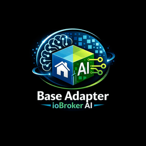

# ioBroker.basic-ai



**Basic AI** is a small JavaScript test adapter for ioBroker. It ships with your logo, a JSON admin config, a few demo states, and a release flow that follows the current ioBroker adapter conventions.

## What is included

- JavaScript adapter scaffold
- JSON config in `admin/jsonConfig.json`
- test states:
  - `basic-ai.0.status.ready`
  - `basic-ai.0.status.message`
  - `basic-ai.0.test.trigger`
- `release-script` integration
- GitHub Actions workflow template for tests and releases
- basic test setup with `@iobroker/testing`

## Development

```bash
npm install
npm run check
npm run lint
npm test
```

## Release flow

Use the release script instead of publishing manually:

```bash
npm run release
```

Examples:

```bash
npm run release patch
npm run release minor
npm run release major
```

## Repository placeholders

Before publishing, replace these placeholders with your real repository data:

- `https://github.com/yourname/ioBroker.basic-ai`
- `https://raw.githubusercontent.com/yourname/ioBroker.basic-ai/...`

## Changelog

<!--
  Placeholder for the next version (at the beginning of the line):
  ### **WORK IN PROGRESS**
-->

### **WORK IN PROGRESS**

- added release-script support and current ioBroker workflow files
- added a runnable Basic AI test adapter scaffold with logo and test states

### 0.0.1 (2026-03-19)

- initial repository scaffold

## License

MIT License

Copyright (c) 2026 nexoWatt


## nexoWatt Trigger

Der wiederverwendbare Trigger für neue Chats liegt in `NEXOWATT_IOBROKER_ADAPTER_STANDARD_TRIGGER.md`.
